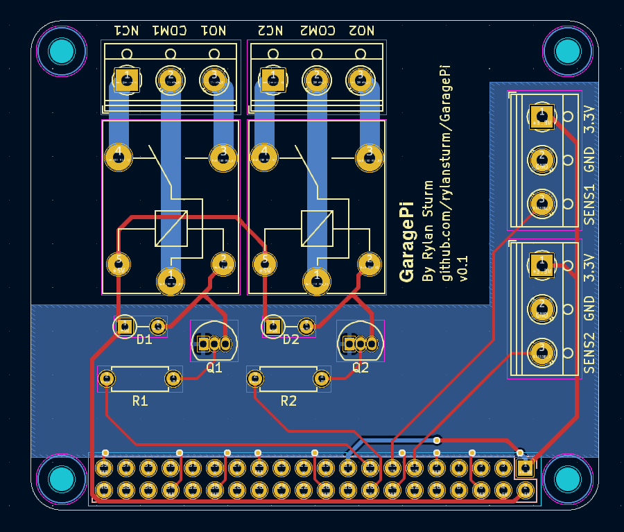

# GaragePi

#### UPDATE 9/7/2023

About a month ago I got the case printed and everything mounted in my garage.
The sensors are IR prox sensors that sit just above the door when closed, but
the PCB can work with anything that has a 3.3V, GND, and Sensor pin configuration.
The wiring is a CAT5 cable terminated with an aviation plug on the Pi side and
screw terminals on the sensor side.

I can access the Pi remotely via SSH. I am now working on setting up an MQTT 
(Mosquitto) broker on my home network. Then I'll work on setting up an API and
GUI on my public server so remote access is more user friendly.

## Specs

#### Basic Requirements

Non-destructive. The project must not remove anything from the current
garage door system. Wires can be added into and below the physical 
buttons that are on the garage wall now. Disconnection should be easy.

Open/Close. A relay can be used to make the connection that send the
signal to the garage openers. 

Scalable. The system should support my two garage doors, and
should ideally be scalable up or down easily. One door without useless
clutter in the UI, 3 doors just as simply.

Sensors. I should be able to read the current state of the garage.

#### MVP

A minimum viable project is one where I can control my garage door
via ssh when connected to WiFi. That just means Raspberry Pi, 
Relay board, and a local bash script. Let's go.

#### UPDATE 3/20/2023

Minimum viable project is in place. I can now open and close garage doors
by running the rust script with argument '1' or '2'. Only from local network.
No monitoring system in place

#### UPDATE 6/26/2023

A PCB has been designed that will sit on top of the Pi.
It has been ordered and should be in place in the next week or so.
Now on to designing the sensors.

#### PCB Design

